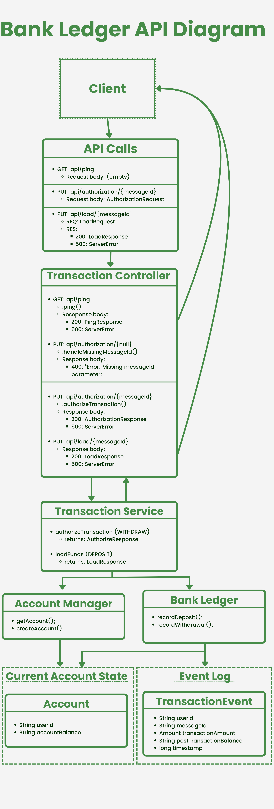

## Bank App with Event Sourcing Design Pattern
- This app implements the event sourcing pattern to record all banking transactions as immutable events. 
- Each event captures relevant information such as transaction type, amount, timestamp, and account identifier.


## Bootstrap instructions
To run this server locally, do the following:
1. *Clone this repo:* Grab the HTTPS URL from the main page of this repository and clicking the `<> Code` button. Open a Terminal and change the current working directory to where you'd like the cloned repository to be stored. Use following git command: `git clone <repository_HTTPS_URL>`.
2. *Open the project in an IDE:* Find the cloned repo and open it in an IDE like IntelliJ IDEA or VS Code.
3. *Build the Maven project:* Do this by running `mvn clean package` or through your IDE toolbar (e.g. in IntelliJ: Build > Build Project).
4. *Run the server:* In IntelliJ, right-click the Main class and click "Run Main.main()". In VS Code, you'll have to download the [Extension Pack for Java](https://code.visualstudio.com/docs/java/java-debugging) and click "Run and Debug".
5. *[OPTIONAL] Open API platform:* To interact with this server, you can use an GUI like [Postman](https://code.visualstudio.com/docs/java/java-debugging) to send and receive HTTP requests. Or you can send requests via terminal commands such as:
   ```curl -X PUT http://localhost:3000/api/load/1234 -H "Content-Type: application/json" -d '{"userId": "validUserId", "messageId" : "1234", "transactionAmount": {"amount" : "100.00", "currency" : "USD", "debitOrCredit" : "CREDIT"}}'```
6. *Send some HTTP requests:* Play around with the routes (e.g. send GET requests to `"api/ping/"` and PUT requests to `"api/load/{messageId}"` and `"api/authorize/{messageId}"`).

## Design considerations
### MCS Overview
I decided to build out the backend in a Model-Controller-Service (MCS) pattern. I started out without a View (a front-end user-interface) to focus business logic, although I would build one out before deploying in a real-life scenario. The MCS pattern organizes the application into separate areas of concern, making the codebase more modular, scalable, easier to test, and more readily-intelligible to humans. I'll get into finer details of how the application is organized, but here's the big picture of the MCS pattern in this codebase:

- **The Model Layer** encapsulates the application state, representing the data of accounts and event logs. It also defines key objects passed through our API (e.g. `PingResponse`) and other entities that enforce data constraints between objects (e.g. `Amount`).
- **The Controller Layer** holds the application logic that controls data flow. Here this is inhabited by one entity. The `TransactionController` is essentially the application's Air Traffic Control, processing GET and PUT requests, passing valid inputs to the Service Layer, and sending responses back to the client.
- **The Service Layer** holds the business logic of the application. This layer is divided into three sections. The Transaction Service Implementation (`TransactionServiceImpl`) interfaces with the Control layer and interacts with the real meat-and-potatoes of the application: the `BankLedger`. The `BankLedger` creates an event log and updates `Account` balances. Accounts, themselves, are created by a separate service, `AccountManager`, but the `BankLedger` is the entity that updates account balances and records their changes.

### Event Sourcing
In addition to the MCS pattern, this design applies an Event Sourcing pattern. With Event Sourcing:
> [E]very change to the state of an application is captured in an event object, and that these event objects are themselves stored in the sequence they were applied for the same lifetime as the application state itself. - [Martin Fowler](https://martinfowler.com/eaaDev/EventSourcing.html)

In this application, we see Event Sourcing play out in the Service Layer. The `TransactionControllerImpl` ingests and assesses incoming Load and Authorize requests (i.e. deposits and withdrawals) and passes them to the `BankLedger` -- even denied transactions. The `BankLedger`, in turn, acts as an event processor: it updates the `Account` state and stores the transaction and its result in an immutable `TransactionEvent`, which might look like this:

```
{
    "userId" : "user200091",
    "messageId" : "120009958-3993918",
    "transactionAmount" : {
        "amount" : "300.00",
        "currency" : "USD",
        "debitOrCredit" : "CREDIT"
    }
    "responseCode" : "APPROVED",
    "postTransactionBalance" : "600",
    "timestamp" : 1714954993071
}
```

I decided to store the account balance separately from the Event Log to allow for quick retrieval of the current application state (by invoking `account.getBalance()`). The account balance, itself, is only ever updated by the `BankLedger` — which produces a `TransactionEvent` that keeps track of every `transactionAmount` and `postTransactionBalance` — ensuring the `BankLedger` event log is the single source of truth.


There are some typical features of Event Sourcing that are missing from this application, namely due to time constraints. To name a few:
- **Reversals:** The ability to scroll back through the event log to revert to a previous state.
- **Event Replay:** The ability to revise an incorrect event by reversing up to that point and replaying the corrected event and subsequent ones. This would be great for fixing problems caused by asynchronous transactions or type-os.
- **Rebuild:** the ability to scrape application state and rebuild it by going through each event sequentially.

### Idempotence
I wanted to be sure to enforce idempotent transactions, meaning that if the same request was sent multiple times, it would have the same result as if it were sent once. To achieve this, I decided to enforce unique messageIds for each transaction.

When I first built this out, I had the `BankLedger` iterate through each `transactionEvent` in its ArrayList. This was a Linear O(1) Time-Complexity, which would create more latency as more requests were sent. I decided, then, to bring this enforcement to the Controller layer. I built a HashSet called `messageIdSet`, which has Constant O(1) Lookup. The `TransactionController` looks into the `messageIdSet` and blocks any request with a `messageId` already contained therein. I decided to be strict and even store the `messageId` of any rejected/invalid request.

A more user-friendly implementation of this idempotence enforcement would be to only store the `messageId` of valid transactions — and upon receiving a repeated `messageId`, returning the original Authorization or Load Response instead of throwing an error. This way, if a user accidentally sent a request twice, they would still be able to see their balance and confirm their request was processed.

This design makes the front end responsible for the production of unique identifiers, since the OpenAPI schema required that the `messageId` be in the params of Load and Authorization PUT requests (i.e. `"api/load/{messageId}"`).

### Javalin Framework:
I decided to build this out on Javalin, a very lightweight web framework. I chose it mainly for its simplicity: its out-of-the-box Jetty server was quick to set up, its default-blocking and unopinionated design made it easy to start programming, and its lightweight nature aids performance. It also has built in testing support (with JUnit and TestNG).

Javalin came with its own set of trade-offs compared to a more established and heavier framework like Spring. While I do love the freedom and agility afforded by unopinionated frameworks, as the codebase grows problems might arise from unenforced style conventions, or using default configurations offered by Spring. Spring also has vast ecosystem of products (Spring Boot, Spring Data, Spring Cloud, Spring Security) that integrate easily, whereas with Javalin we'd have to add integrations piecemeal and hope they play nicely with the core framework. Spring Data, for example, might be helpful for expanding the codebase to databases to store event logs. Lastly, and crucially: Spring has a bigger community and more detailed documentation. Hitting walls with Javalin was tough because I often had to sift through its source code to find answers to my questions that weren't in their scant tutorials.

Despite these drawbacks, Javalin's intuitive and easy-to-learn framework sped up the on-ramp to development and kept my codebase simple and clean.

### Design Diagram:



## Assumptions
This application makes several assumptions, namely:
- For a quick on-ramp, I opted to stare application state and event logs in memory. This assumes that 1) data persistence is not important and 2) the machine can handle the load of however many accounts and event logs are created. One major way to improve this backend would be to create an external database to hold accounts and event logs.
- The Javalin framework is blocking by default. This could lead to issues and low responsiveness with multiple concurrent requests. I made the BankLedger's methods synchronized to ensure atomicity and the chronological order of the event log, but we could refactor the Javalin server to be async, allowing for simultaneous connections.
- The only way to interface with the application is through `curl` commands or GUI platform like Postman. Ideally, before deployment I'd build out a front end to allow for easier interaction with the app.
- The `Account` allows for only 1 type of account per user (no "Checking" vs "Savings"), and assumes each user would have only 1 account.
- This program assumes that no one would pick the same userId — some more `Account.userId` validation should be enforced before deployment.
- Currently, the Transaction Controller doesn't allow for a repeated, non-unique `messageId` in Load or Authorization Requests, which assumes users will be able to manually produce a random identifier with each transaction. I would implement a front end so that it would assign a unique UUID as the `messageId` upon sending requests.
- The app assumes that the user sending requests has legitimate access to the accounts. There are no checks for fraud (and less nefarious: mistyping one's userId could grant access to a different `Account`).
- The app assumes the only reason a request would be `DENIED` is if the account had insufficient funds. The app also assumes all Load requests are `APPROVED`.
- The BankLedger assumes all Request `currency` matches that of the `Account` balance. Before deployment, currency exchange functionality should be implemented.
- As mentioned in the above section, this backend assumes that some common Event Sourcing functionality (e.g. Event Replay) are not needed.


## Deployment considerations
Before deployment, I would beef up the existing codebase to include:
- A database to store application state and event logs.
- Implementing auth of some kind to ensure that users have legitimate access to accounts.
- Building out a front end to allow users to interact with the backend.
- Add more error handling, validation, more edge cases in unit tests, and more comprehensive integration tests.

As for the deployment, itself:
- To ensure consistent deployment across different machines, I would use Docker to containerize the application and all of its dependencies.
- I am a fan of serverless architecture, so I would use a fully-managed service like AWS Fargate with Elastic Load Balancer and Elastic Container Registry.
- If we are using AWS, it might make sense to look into hosting our event logs and application state there too. We could use S3 for our logs and Athena to query them. We could also track `TransactionEvent` logs using pub-sub SQS or use SNS to trigger a CloudWatch event that invokes a Lambda function to update `Account` state.
- Alternatively, we could use the serverless database AWS Aurora — which we could configure with Multi-AZ deployment to allow for higher availability of our event logs.
- We could use CloudWatch for monitoring, although I am a fan of Prometheus for its powerful and fast queries.
- Implement a CI/CD pipeline. I'm a fan of GitHub actions for its seamless integration with existing Pull Request / Issue workflows. 
